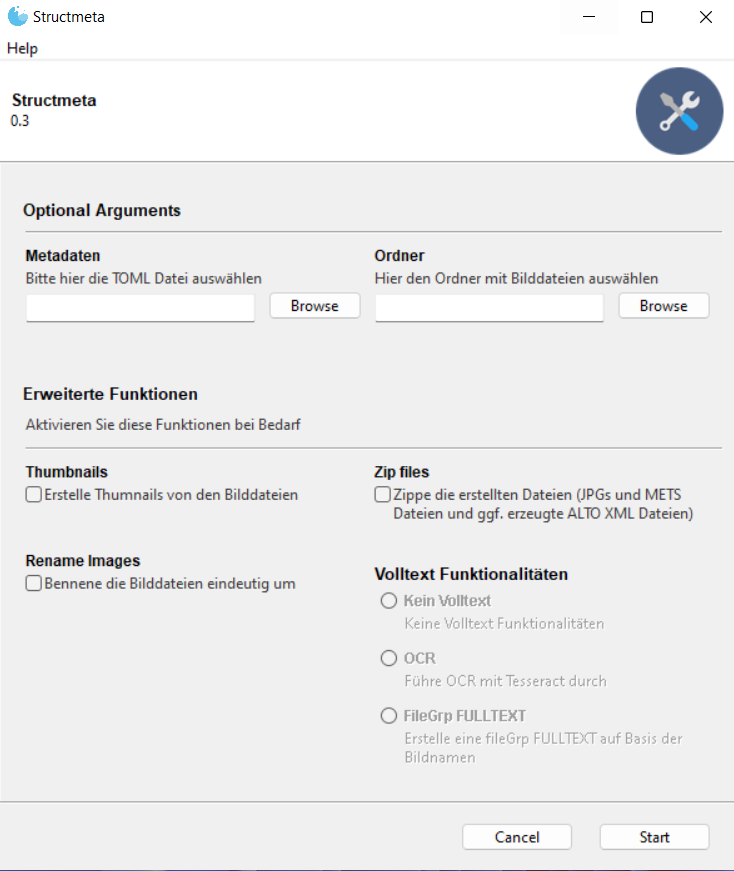
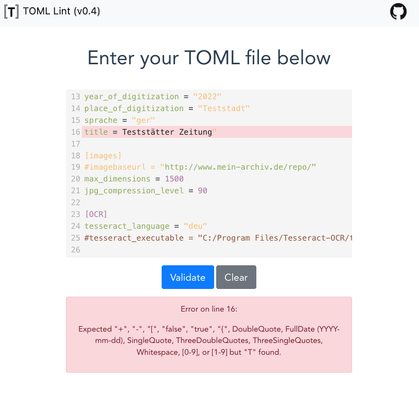
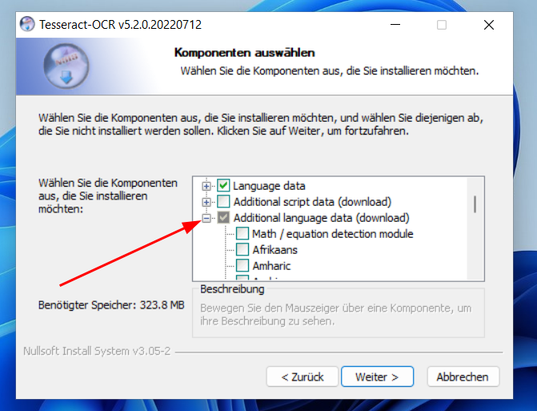
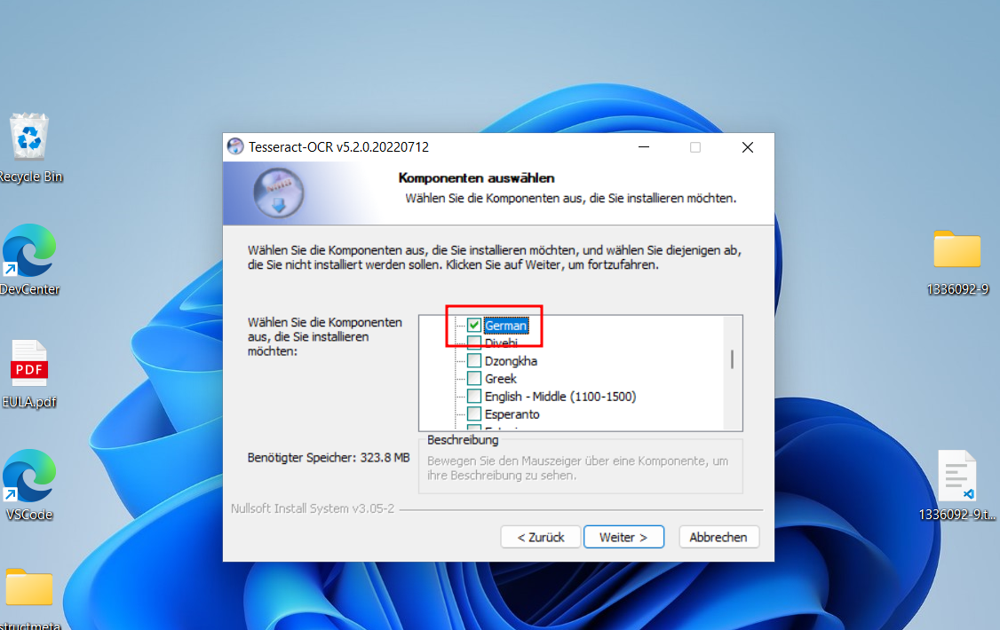

# Structmeta

> :warning: **Diese Software wird nicht mehr aktiv von der Deutschen Digitalen Bibliothek weiterentwickelt - es kann auch kein Support gewährleistet werden**

> :information_source: Ein Video-Tutorial zur Benutzung von Structmeta für Zeitungen finden Sie [bei Vimeo](https://vimeo.com/774251098).

## Installation

Entweder die ausführbaren Dateien für Windows von https://github.com/Deutsche-Digitale-Bibliothek/ddblabs-structmeta/releases herunterladen oder, für Entwickler und technisch versierte Nutzer:innen, das Git Repo klonen und mit `pip install .` im Verzeichnis die Installation starten.

## Beschreibung

Mit dem structmeta-Script lassen sich durch die Ablage von Scans in einer speziellen Ordnerstruktur DDB- bzw. Zeitungsportal konforme METS/MODS XML-Dateien herstellen.

Structmeta kann METS/MODS für Monographien, Zeitschriften und Zeitungen erstellen; am besten funktioniert es auf Grund der geringen Anforderungen für Zeitungsausgaben.

Das Programm benötigt zum Funktionieren neben einer speziellen Ordnerstruktur, in der die Digitalisate abgelegt sind, pro Vorgang eine Datei in der Metadaten, die für den gesamten Vorgang gelten, enthalten sind. Diese Metadaten müssen im `TOML` Format vorliegen (s.u.).

Automatisch läuft eine TIF zu JPG Umwandlung.

Nach Programmaufruf muss der Pfad zur `TOML` Datei ausgewählt werden und der Ordner, der bearbeitet werden soll.

Die Erweiterten Funktionen sind:

- **Thumbnails**: Erzeugt für jede Bilddatei kleingerechnete Thumbnail Bilder
- **OCR**: Erstellt pro Bild eine ALTO-XML Datei mit Tesseract (siehe unten, Work in Progress, erfordert eine externe Installation)
- **ZIP**: Erstellt zwei ZIP-Dateien für die Übergabe der Bilder und der Metadaten an die Fachstelle Bibliothek der DDB
- **Rename Images**: Kann die Bilder eindeutig umbenennen, nützlich falls bspw. in jedem Unterordner Bilder mit Namen wie `01.jpg` liegen



Das Script kann auch im Kommandozeilenmodus laufen:

```
python structmeta.py --ignore-gooey --help
```

## Vorbemerkungen

Das Programm geht davon aus, dass die Namen der Bilderdateien auf Projektebene eindeutig sind. Ist dies nicht der Fall, müssen die Bilddateien umbennant werden (Option "Rename Images").

## Metadaten

Die TOML Datei besteht aus vier Ebenen: Einmal Informationen zum Datenpartner, und einmal Informationen zu den Objekten. Die Ebenen werden durch die festgelegte Strings in eckigen Klammern definiert. `[institution]` und `[objects]` sind verpflichtend, `[images]` und `[OCR]` können auch weg gelassen werden. Unterhalb dieser Ebenen wird pro Zeile einem Schlüssel durch ein `=` Zeichen ein Wert zugewiesen. Zeichenfolgen werden dabei in Anführungsstriche gesetzt. Die TOML-Datei ist mit einem Plaintext-Texteditor zu bearbeiten (nicht etwa mit Word o.ä.). Mit Tools wie bspw. [TOML Lint](https://www.toml-lint.com/) kann die erzeugte TOML Datei validiert und auf Syntaxfehler geprüft werden. Das sieht dann exemplarisch so aus - hier fehlt in Zeile 16 ein einfaches Anführungszeichen:



### TOML Beispiel

```toml
[institution]
isil = "DE-1234"
name = "Kreisarchiv Teststadt"
logoURL = "https://www.mein-archiv.de/logo.svg"
siteURL = "https://www.mein-archiv.de"
contact = "kontakt@mein-archiv.de"
license = "https://creativecommons.org/publicdomain/mark/1.0/"

[objects]
type = "newspaper"
erscheinungsort = "Teststadt"
verlag = "Testverlag"
year_of_digitization = "2022"
place_of_digitization = "Teststadt"
sprache = "ger"
title = "Teststätter Zeitung"

[images]
#imagebaseurl = "http://www.mein-archiv.de/repo/"
max_dimensions = 500
jpg_quality = 20

[OCR]
tesseract_language = "deu"
tesseract_executable = "C:/Program Files/Tesseract-OCR/tesseract.exe"
```

Erweiterte Informationen zu den Elementen finden Sie unter: https://github.com/karkraeg/structmeta/blob/main/toml-elements.md.

> :warning: Wenn OCR durchgeführt werden soll, dürfen nicht gleichzeitig mit `max_dimensions` die JPGs verkleinert werden. (Siehe [Issue](https://github.com/Deutsche-Digitale-Bibliothek/ddblabs-structmeta/issues/2))

## Ordnerstrukturen

### Zeitungen

Für Zeitungen muss die Ordner/Dateistruktur wie folgt aussehen:

Auf der obersten Ebene ein Ordner der nach der [ZDB ID](https://zdb-katalog.de) der **digitalen Ausgabe** der Zeitung benannt ist, darunter pro Ausgabe ein Ordner, der mit dem Tagesdatum der Veröffentlichung in ISO (vierz Ziffern für das Jahr, Bindestrich, zwei Ziffern für Monat und Tag, getrennt durch einen Bindestrich. Also `YYYY-MM-DD`) beginnt. Darunter liegen die Scans der Ausgabe durch ihren Dateinamen in der richtigen Reihenfolge. Die Seiten sollten also irgendwie numerisch aufsteigend gekennzeichnet sein.

```
- 984399-1
    - 1802-01-01
        - img0001.jpg
        ...
    - 1802-01-02
```

### Zeitschriften (Journals)

Achtung: Structmeta kann _keine Gesamtaufnahme_ erstellen, da diese von der DDB auch nicht gehostet werden könnte. Daher werden Jorunals als `monograph` angegeben.

Ordner/Dateistruktur: Auf der obersten Ebene der Titel der Zeitschrift, darunter pro Jahrgang ein Ordner, der am Ende mit einem Unterstrich abgetrennt das Jahr enthält. Unter dem Ordner des Jahrgangs dann pro Strukturelement ein Ordner (bspw. pro Heft), der nach einem Unterstrich den Titel des Elements enthält (statt `Jahrgang_1808_Ausgabe Januar` wäre auch `_Ausgabe Januar` möglich oder `Zeitschrift_Jahrgang_1808_Ausgabe Januar`. In allen Fällen wird als Titel `Ausgabe Januar` erkannt):

```
Testzeitschrift
    - Jahrgang_1807
    - Jahrgang_1808
      - Jahrgang_1808_Titel
        - Zeitschrift_1908_001.jpg
      - Jahrgang_1808_Inhaltsverzeichnis
        - Zeitschrift_1908_002.jpg
      - Jahrgang_1808_Ausgabe Januar
        - Zeitschrift_1908_003.jpg
        - Zeitschrift_1908_004.jpg
        - Zeitschrift_1908_005.jpg
        ...
    - Jahrgang_1809
```

### Monographien (Work in Progress)

Ordner/Dateistruktur: Auf der obersten Ebene ein Ordner unter dem die Monographien sortiert werden, darunter für jedes Werk ein Ordner. Unterhalb eines jeden Werkes dann für die Strukturelemente Ordner, in denen sich die entsprechenden Bilder befinden.

Achtung: Diese Funktionalität ist noch nicht ausgereift. Außerdem fehlen für Monographien fast alle Angaben!

```
Monographien
    - Der Testfall
    - Abhandlungen die Testreichen Tests betreffend
      - Titel
        - xy1000_001.jpg
      - Inhaltsverzeichnis
        - xy1000_002.jpg
      - Kapitel 1 / Ausgabe Januar
        - xy1000_003.jpg
        - xy1000_004.jpg
        - xy1000_005.jpg
        ...
    - Der Zauberlehrling
```

## OCR

Unter Verwendung einer externen Installation von Tesseract kann für jede Bilddatei eine zugehörige ALTO XML Datei erstellt und in einer `mets:fileGrp@USE=FULLTEXT` referenziert werden.

### Installation von Tesseract

#### Ubuntu

```
sudo add-apt-repository ppa:alex-p/tesseract-ocr-devel
sudo apt update
sudo apt install tesseract-ocr
sudo apt-get install tesseract-ocr-deu
```

#### Windows

- siehe https://github.com/UB-Mannheim/tesseract/wiki#tesseract-installer-for-windows
- Im Schritt Komponenten auswählen entsprechende benötigte Sprachpakete laden:



